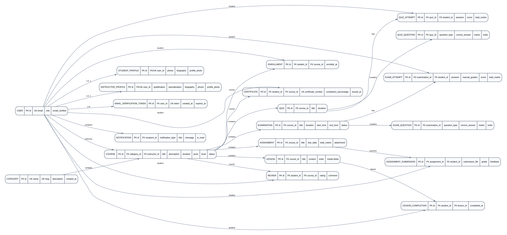

# Education LMS API

A role-aware Learning Management System REST API built with Django REST Framework. The API supports authentication, course delivery, enrollments, lessons, assignments, quizzes, examinations, grading, certificates, reviews, notifications, and role-specific analytics.

## Highlights

- Custom email-based user authentication
- Student, instructor, and administrator roles
- JWT authentication with refresh tokens and refresh-token blacklisting on logout
- Email verification and password-reset flows
- Instructor onboarding controlled by administrators
- Course/category/lesson management
- Course enrollment and lesson completion tracking
- Assignments, file submissions, grading, and feedback
- Quizzes with timed attempts and automatic objective grading
- Scheduled examinations with MCQ, true/false, and essay questions
- Manual grading for examination essay questions
- Aggregated grades and course-level results
- Certificate issuance based on graded course work
- Course reviews and rating summaries
- In-app notifications and read-state actions
- Student, instructor, and administrator analytics
- Search, filtering, and ordering on supported resources
- OpenAPI schema, Swagger UI, and ReDoc documentation
- Postman collection with collection-variable automation

## Technology stack

| Component | Version |
|---|---:|
| Python | 3.14+ recommended for the current development environment |
| Django | 6.1 |
| Django REST Framework | 3.18.0 |
| Simple JWT | 5.5.1 |
| drf-spectacular | 0.30.0 |
| django-filter | 26.1 |
| Pillow | 12.3.0 |
| django-cors-headers | 4.9.0 |
| python-decouple | 3.8 |
| Database | SQLite for the included development configuration |

Exact package versions are pinned in `requirements.txt`.

## Project structure

```text
lms_project/
├── accounts/          # Users, roles, profiles, authentication
├── analytics/         # Student/instructor/admin analytics
├── assessments/       # Assignments, quizzes, exams, grades, certificates
├── courses/           # Categories, courses, lessons
├── enrollments/       # Enrollments and lesson completion
├── notifications/     # In-app notifications
├── reviews/           # Course reviews and rating summaries
├── config/             # Django project configuration and URL routing
├── docs/
│   ├── ERD.md
│   ├── ERD.svg
│   ├── ERD.dot
│   └── POSTMAN_GUIDE.md
├── samples/            # Small local fixtures for Postman file uploads
├── LMS_API.postman_collection.json
├── manage.py
├── requirements.txt
└── .env.example
```

## Architecture at a glance

```text
Client
  │
  ├── Swagger UI / ReDoc
  ├── Postman
  └── Web / Mobile application
          │
          ▼
     Django REST API
          │
    ┌─────┼───────────────────────────────┐
    │     │                               │
 accounts courses/enrollments       assessments
    │     │                               │
    └─────┴──────────────┬────────────────┘
                         │
                  notifications/reviews
                         │
                         ▼
                    Database + Media
```

The application uses Django apps to separate major business domains. DRF serializers define request/response representations and validation; viewsets/APIViews implement endpoint behavior; permission classes enforce role/ownership rules.

## Roles

### Student

Students can:

- register publicly
- verify their email
- log in and refresh JWT tokens
- view published courses
- enroll in courses
- access lessons for enrolled courses
- mark lessons as completed
- submit assignments
- attempt quizzes and examinations
- view their grades/results/certificates
- review enrolled courses
- view and manage their notifications
- access student analytics

### Instructor

Instructors can:

- authenticate after administrator-controlled onboarding
- manage their own courses
- manage lessons belonging to their courses
- create and manage assignments, quizzes, examinations, and questions for their courses
- view submissions for their courses
- grade assignment submissions
- manually grade examination essay questions
- view grades/results for their courses
- issue certificates for students in their courses when the certificate requirements are met
- access instructor analytics

### Administrator

Administrators can:

- manage instructors
- manage categories
- manage all courses and learning content
- view and manage enrollments
- manage assessments and grading
- issue/manage certificates
- manage reviews and notifications where the relevant permissions allow it
- access platform-wide analytics

## Authentication

The API uses JWT bearer authentication.

### Login

```http
POST /api/auth/login/
Content-Type: application/json
```

Example request:

```json
{
  "email": "student@example.com",
  "password": "StrongPassword123!"
}
```

The response contains an access token and refresh token. Send the access token on protected requests:

```http
Authorization: Bearer <access-token>
```

### Refresh

```http
POST /api/auth/refresh/
Content-Type: application/json
```

```json
{
  "refresh": "<refresh-token>"
}
```

### Logout

```http
POST /api/auth/logout/
Authorization: Bearer <access-token>
Content-Type: application/json
```

```json
{
  "refresh": "<refresh-token>"
}
```

Logout blacklists the supplied refresh token.

## Authentication lifecycle

### Student registration

```text
Register
   ↓
Verification email
   ↓
Verify email
   ↓
Account activated
   ↓
Login
   ↓
JWT access + refresh tokens
```

Public registration creates a `STUDENT` account. Public clients cannot select `INSTRUCTOR` or `ADMIN` during registration.

### Instructor onboarding

```text
Administrator creates instructor
          ↓
Verification/setup token
          ↓
Instructor sets password
          ↓
Account activated
          ↓
Instructor login
```

## Environment configuration

Create a local `.env` file from `.env.example`.

```env
EMAIL_HOST=smtp.example.com
EMAIL_PORT=587
EMAIL_USE_TLS=True
EMAIL_HOST_USER=your-email@example.com
EMAIL_HOST_PASSWORD=your-email-password
DEFAULT_FROM_EMAIL=your-email@example.com
```

Do **not** commit `.env` or real credentials to source control.

The included settings also support:

```text
BACKEND_URL=http://127.0.0.1:8000
```

`BACKEND_URL` defaults to the local development URL if it is not supplied.

## Installation

### 1. Clone the project

```bash
git clone <repository-url>
cd lms_project
```

### 2. Create a virtual environment

Windows:

```bash
python -m venv .venv
.venv\Scripts\activate
```

Linux/macOS:

```bash
python3 -m venv .venv
source .venv/bin/activate
```

### 3. Install dependencies

```bash
pip install -r requirements.txt
```

### 4. Configure environment variables

Create `.env` using `.env.example` and provide the email settings required by the authentication flows.

### 5. Apply migrations

```bash
python manage.py migrate
```

### 6. Create an administrator

```bash
python manage.py createsuperuser
```

The custom user model uses email as the login identifier.

### 7. Start the development server

```bash
python manage.py runserver
```

The default development server is:

```text
http://127.0.0.1:8000/
```

## API documentation

### Swagger UI

```text
http://127.0.0.1:8000/api/docs/
```

Swagger UI provides interactive API documentation and request execution.

### ReDoc

```text
http://127.0.0.1:8000/api/redoc/
```

ReDoc provides a reading-oriented view of the same OpenAPI schema.

### OpenAPI schema

```text
http://127.0.0.1:8000/api/schema/
```

The schema is generated by drf-spectacular.

## API endpoint overview

The API currently exposes 56 unique URL paths and more than 100 operations when CRUD methods and custom actions are counted.

### Authentication

| Method | Endpoint | Purpose |
|---|---|---|
| POST | `/api/auth/register/` | Register a student |
| POST | `/api/auth/verify-email/` | Verify email |
| POST | `/api/auth/login/` | Obtain JWT tokens |
| POST | `/api/auth/refresh/` | Refresh access token |
| POST | `/api/auth/logout/` | Blacklist refresh token |
| POST | `/api/auth/password-reset/` | Request password reset |
| POST | `/api/auth/password-reset-confirm/` | Confirm password reset |
| POST | `/api/auth/instructors/` | Create instructor |
| POST | `/api/auth/instructors/set-password/` | Set instructor password |

### Profile

| Method | Endpoint | Purpose |
|---|---|---|
| GET | `/api/profile/` | Get authenticated user profile |
| PATCH | `/api/profile/` | Update authenticated user profile |

### Courses and learning content

| Method | Endpoint | Purpose |
|---|---|---|
| GET/POST | `/api/courses/` | List/create courses |
| GET/PUT/PATCH/DELETE | `/api/courses/{id}/` | Retrieve/update/delete course |
| GET/POST | `/api/categories/` | List/create categories |
| GET/PUT/PATCH/DELETE | `/api/categories/{id}/` | Retrieve/update/delete category |
| GET/POST | `/api/lessons/` | List/create lessons |
| GET/PUT/PATCH/DELETE | `/api/lessons/{id}/` | Retrieve/update/delete lesson |
| POST | `/api/lessons/{id}/complete/` | Complete lesson as an enrolled student |
| GET/POST/DELETE | `/api/enrollments/` | List/create/delete enrollments |
| GET/DELETE | `/api/enrollments/{id}/` | Retrieve/delete enrollment |

### Assignments and submissions

| Method | Endpoint | Purpose |
|---|---|---|
| GET/POST | `/api/assignments/` | List/create assignments |
| GET/PUT/PATCH/DELETE | `/api/assignments/{id}/` | Manage assignment |
| POST | `/api/submissions/` | Submit assignment |
| GET | `/api/submissions/` | List submissions visible to current user |
| GET/PATCH/DELETE | `/api/submissions/{id}/` | Retrieve/resubmit/delete submission |
| POST | `/api/submissions/{id}/grade/` | Grade assignment submission |

### Quizzes

| Method | Endpoint | Purpose |
|---|---|---|
| GET/POST | `/api/quizzes/` | List/create quizzes |
| GET/PUT/PATCH/DELETE | `/api/quizzes/{id}/` | Manage quiz |
| GET | `/api/quizzes/{id}/questions/` | List questions for a quiz |
| GET/POST | `/api/quiz-questions/` | List/create quiz questions |
| GET/PUT/PATCH/DELETE | `/api/quiz-questions/{id}/` | Manage quiz question |
| GET/POST | `/api/quiz-attempts/` | List/start quiz attempts |
| GET | `/api/quiz-attempts/{id}/` | Retrieve quiz attempt |
| POST | `/api/quiz-attempts/{id}/submit/` | Submit quiz attempt |

### Examinations

| Method | Endpoint | Purpose |
|---|---|---|
| GET/POST | `/api/examinations/` | List/create examinations |
| GET/PUT/PATCH/DELETE | `/api/examinations/{id}/` | Manage examination |
| GET | `/api/examinations/{id}/questions/` | List examination questions |
| GET/POST | `/api/exam-questions/` | List/create examination questions |
| GET/PUT/PATCH/DELETE | `/api/exam-questions/{id}/` | Manage examination question |
| GET/POST | `/api/exam-attempts/` | List/start examination attempts |
| GET | `/api/exam-attempts/{id}/` | Retrieve examination attempt |
| POST | `/api/exam-attempts/{id}/submit/` | Submit examination attempt |
| PATCH | `/api/exam-attempts/{id}/grade/` | Manually grade examination question |

### Grades and results

| Method | Endpoint | Purpose |
|---|---|---|
| GET | `/api/grades/` | Aggregate assignment, quiz, and examination grades |
| GET | `/api/results/` | Calculate course results |
| GET | `/api/results/?course={id}` | Filter results by course |

For quizzes and examinations, the grade endpoint uses the highest submitted attempt for each student/assessment combination.

### Certificates

| Method | Endpoint | Purpose |
|---|---|---|
| GET/POST | `/api/certificates/` | List/issue certificates |
| GET/PUT/PATCH/DELETE | `/api/certificates/{id}/` | Manage certificate |

Certificates calculate completion from graded assignments plus the highest submitted quiz/examination attempts for the course.

### Reviews

| Method | Endpoint | Purpose |
|---|---|---|
| GET/POST | `/api/reviews/` | List/create reviews |
| GET/PATCH/DELETE | `/api/reviews/{id}/` | Retrieve/update/delete review |
| GET | `/api/reviews/course/{course_id}/summary/` | Average rating and review count |

Students must be enrolled in a course before reviewing it and can create only one review per course.

### Notifications

| Method | Endpoint | Purpose |
|---|---|---|
| GET | `/api/notifications/` | List notifications |
| GET | `/api/notifications/{id}/` | Retrieve notification |
| POST | `/api/notifications/{id}/mark-read/` | Mark one notification read |
| POST | `/api/notifications/mark-all-read/` | Mark all notifications read |
| GET | `/api/notifications/unread-count/` | Count unread notifications |

### Analytics

| Method | Endpoint | Purpose |
|---|---|---|
| GET | `/api/analytics/student/` | Student learning analytics |
| GET | `/api/analytics/instructor/` | Instructor course analytics |
| GET | `/api/analytics/admin/` | Platform-wide analytics |

## Filtering, search, and ordering

Supported resources use DRF's filter, search, and ordering backends where configured.

### Courses

Filters:

```text
?category=1
?category__slug=programming
?level=BEGINNER
?status=PUBLISHED
```

Search:

```text
?search=python
```

Ordering:

```text
?ordering=title
?ordering=-price
?ordering=-created_at
```

### Lessons

```text
?course=1
?search=variables
?ordering=order
```

### Assignments

```text
?course=1
?search=python
?ordering=-due_date
```

### Quizzes

```text
?course=1
?search=python
?ordering=-created_at
```

### Examinations

```text
?course=1
?status=SCHEDULED
?search=python
?ordering=start_time
```

### Reviews

```text
?course=1
?rating=5
?search=excellent
?ordering=-created_at
```

### Current pagination status

Pagination is **not currently configured** in the uploaded project configuration. List endpoints therefore return the configured queryset directly rather than a DRF paginated response. If pagination is introduced later, update both the API contract and the Postman/README examples together.

## Postman

Import:

```text
LMS_API.postman_collection.json
```

The collection is deliberately environment-free. All runtime state is stored in collection variables.

### Automatic variables

Login scripts save:

```text
access_token
refresh_token
current_role
```

Create requests save resource IDs such as:

```text
category_id
course_id
lesson_id
enrollment_id
assignment_id
submission_id
quiz_id
quiz_question_id
quiz_attempt_id
examination_id
exam_question_id
exam_attempt_id
certificate_id
notification_id
review_id
```

See [`docs/POSTMAN_GUIDE.md`](docs/POSTMAN_GUIDE.md) for the recommended execution order and file-upload workflow.

See [`docs/API_EXAMPLES.md`](docs/API_EXAMPLES.md) for the request bodies captured from the Postman collection.

## Testing

Run Django's test suite with:

```bash
python manage.py test
```

For individual apps:

```bash
python manage.py test accounts
python manage.py test courses
python manage.py test enrollments
python manage.py test assessments
python manage.py test notifications
python manage.py test reviews
python manage.py test analytics
```

## Database and media

The included development settings use SQLite:

```text
db.sqlite3
```

Uploaded files are stored under:

```text
media/
```

The production deployment should use a production database and a durable object/file-storage strategy rather than relying on local SQLite/media storage.

## ER diagram

See:

- [`docs/ERD.md`](docs/ERD.md) — Mermaid source and relationship notes
- [`docs/ERD.svg`](docs/ERD.svg) — rendered ER diagram
- [`docs/ERD.dot`](docs/ERD.dot) — Graphviz source



## Security notes before production deployment

The current repository is a development-oriented configuration. Before production deployment:

- set `DEBUG=False`
- move `SECRET_KEY` to an environment variable
- configure production `ALLOWED_HOSTS`
- configure HTTPS and secure cookies where applicable
- use a production database
- use durable media/object storage
- configure CORS for known frontend origins instead of broad development settings
- rotate any credentials that may have been exposed during development
- keep `.env` out of version control
- review JWT lifetimes and token-blacklisting requirements
- configure production email delivery
- run `python manage.py check --deploy`

## API documentation philosophy

The OpenAPI documentation is generated from the actual Django/DRF implementation. `drf-spectacular` inspects serializers, viewsets, APIViews, authentication, filters, and explicit `@extend_schema` metadata.

The project uses explicit schema metadata where business behavior is not obvious from the Python method signature, especially for:

- authentication flows
- role-specific operations
- custom actions such as lesson completion and assessment submission
- custom grading/results endpoints
- request examples
- response descriptions

## Development commands

```bash
# Run server
python manage.py runserver

# Make migrations
python manage.py makemigrations

# Apply migrations
python manage.py migrate

# Create admin
python manage.py createsuperuser

# Run tests
python manage.py test

# Check deployment configuration
python manage.py check --deploy
```

See [`docs/FINALIZATION_NOTES.md`](docs/FINALIZATION_NOTES.md) for a record of the documentation/Postman changes and validation performed.

## License

Add the project's chosen license here before publishing the repository.

## Maintainer

Arinze Ihim
